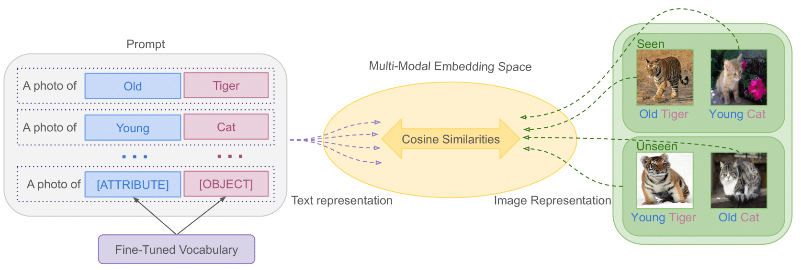

# Compositional Soft Prompting (CSP)
Compositional soft prompting (CSP), a parameter-efficient learning technique to improve the zero-shot compositionality of large-scale pretrained vision-language models (VLMs) without the overhead of fine-tuning the entire model.

Reference Paper: [Learning to Compose Soft Prompts for Compositional Zero-Shot Learning](https://arxiv.org/abs/2204.03574)



If you find CSP helpful, please cite our paper:
```
@artciel{csp2022,
  author = {Nayak, Nihal V. and Yu, Peilin and Bach, Stephen H.},
  title = {Learning to Compose Soft Prompts for Compositional Zero-Shot Learning},
  volume = {arXiv:2204.03574 [cs.LG]},
  year = {2022},
}
```

## Setup
```
conda create --name clip python=3.7
conda activate clip
pip3 install torch torchvision torchaudio --extra-index-url https://download.pytorch.org/whl/cu113
pip3 install ftfy regex tqdm scipy pandas
pip3 install git+https://github.com/openai/CLIP.git
```
Alternatively, you can use `pip install -r requirements.txt` to install all the dependencies.

## Download Dataset
We experiment with three datasets: MIT-States, UT-Zappos, and C-GQA.
```
sh download_data.sh
```

If you already have setup the datasets, you can use symlink and ensure the following paths exist:
`data/<dataset>` where `<datasets> = {'mit-states', 'ut-zappos', 'cgqa'}`.


## Training
```
python -u train.py \
  --dataset mit-states \
  --model ViT-L/14 \
  --experiment_name csp \
  --seed 0 \
  --epochs 20 \
  --lr 5e-05 \
  --attr_dropout 0.3 \
  --weight_decay 0.00001 \
  --train_batch_size 64 \
  --gradient_accumulation_steps 2 \
  --context_length 8 \
  --save_path data/model/mit-states/sample_model \
  --save_every_n 1
```

You can replace `--dataset` with `{mit-states, ut-zappos, cgqa}`.
The best hyperparameters are included in the paper.

## Evaluation
We evaluate our models in two settings: closed-world and open-world.
### Closed-World Evaluation
```
python -u evaluate.py \
  --dataset mit-states \
  --soft_embeddings data/model/mit-states/sample_model/soft_embeddings_epoch_20.pt \
  --context_length 16 \
  --text_encoder_batch_size 36 \
  --eval_batch_size 16 \
  --experiment_name csp
```
### Open-World Evaluation
For our open-world evaluation, we compute the feasbility calibration and then evaluate on the dataset.

### Feasibility Calibration
We use GloVe embeddings to compute the similarities between objects and attributes.
Download the GloVe embeddings in the `data` directory:

```
cd data
wget https://nlp.stanford.edu/data/glove.6B.zip
```
Move `glove.6B.300d.txt` into `data/glove.6B.300d.txt`.

To compute feasibility calibration for each dataset, run the following command:
```
python -u datasets/feasibility.py --dataset mit-states
```
The feasibility similarities are saved at `data/feasibility_<dataset>.pt`.
### Evaluation

The open-world evaluation with the thresholds (feasibility calibration).
```
python -u evaluate.py \
  --dataset mit-states \
  --soft_embeddings data/model/mit-states/sample_model/soft_embeddings_epoch_5.pt \
  --context_length 16 \
  --text_encoder_batch_size 36 \
  --eval_batch_size 256 \
  --experiment_name czsl \
  --threshold <threshold> \
  --open_world
```
If `<threshold>` is None, then the model picks the best threshold on the validation set.
We use the following thresholds:
| Dataset    | Threshold           |
|------------|---------------------|
| mit-states | 0.4069159426        |
| ut-zappos  | 0.5299109123        |
| cgqa       | 0.49937106273612186 |

Note: We use 256GB of cpu memory to evaluate cgqa.

## Generalization to Higher-Order Compositions
Evaluate the trained CSP vocabulary on the new AAO-MIT-States dataset.
```
python aao/evaluate_att_att_obj.py \
  --experiment_name csp \
  --soft_embeddings data/model/mit-states/sample_model/soft_embeddings_epoch_20.pt
```
We thank [Andrew Delworth](https://www.linkedin.com/in/andy-delworth-2a73b31a9) and [Elise Carman](https://www.linkedin.com/in/elise-carman-9914b6154/) for helping us annotate this dataset.

## Generalization to Mixed Pretrained and Fine-Tuned Vocabulary
Ablation experiment to train and evaluate CSP with reduced fine-tuned vocabulary.
We run experiment on the ut-zappos dataset.
### Training
```
python -u mix/mix_train.py \
  --dataset ut-zappos \
  --model ViT-L/14 \
  --experiment_name mix_csp \
  --seed 0 \
  --epochs 20 \
  --lr 5e-04 \
  --attr_dropout 0.2 \
  --weight_decay 0.00001 \
  --train_batch_size 64 \
  --context_length 8 \
  --save_path data/model/ut-zappos/mix_train_model_0.25 \
  --save_every_n 5 \
  --attr_keep_ratio 0.25 \
  --gradient_accumulation_steps 2
```
We change the `--attr_keep_ratio` to `{0.25, 0.50, 0.75}`.
### Evaluation
```
python -u mix/evaluate_mix_train.py \
  --dataset ut-zappos \
  --soft_embeddings data/model/ut-zappos/mix_train_model_0.25/soft_embeddings.pt \
  --context_length 16 \
  --text_encoder_batch_size 36 \
  --eval_batch_size 256 \
  --experiment_name csp
```

## Credits
The project uses openly available model, code, and datasets.
Please see the [credits](credits.md).
